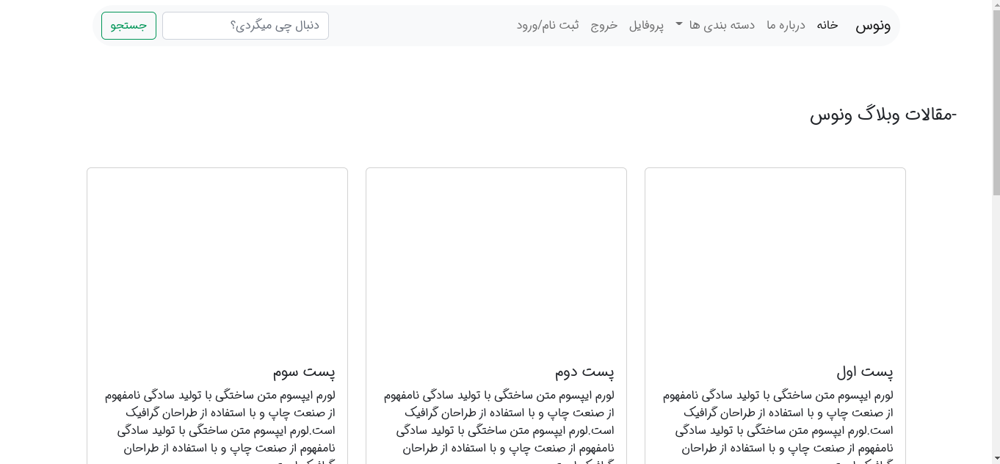
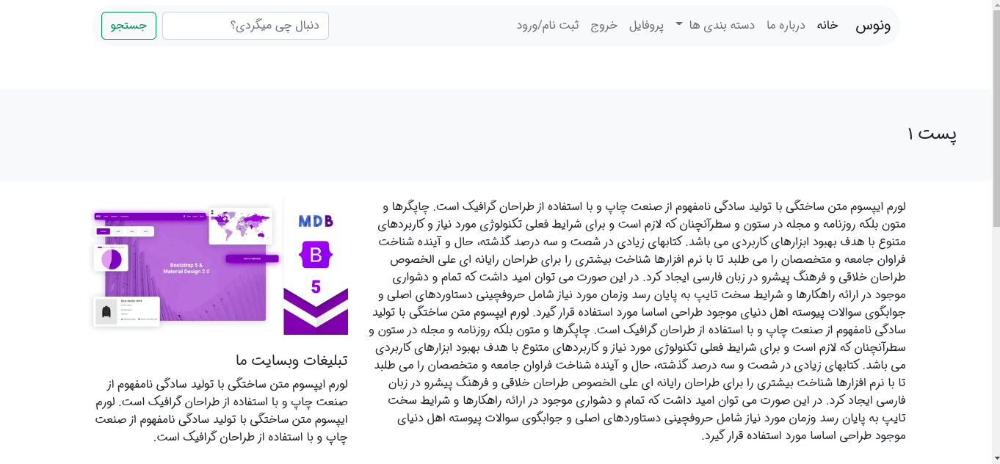
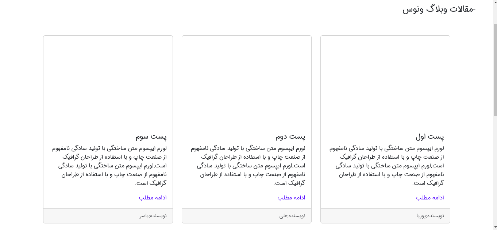
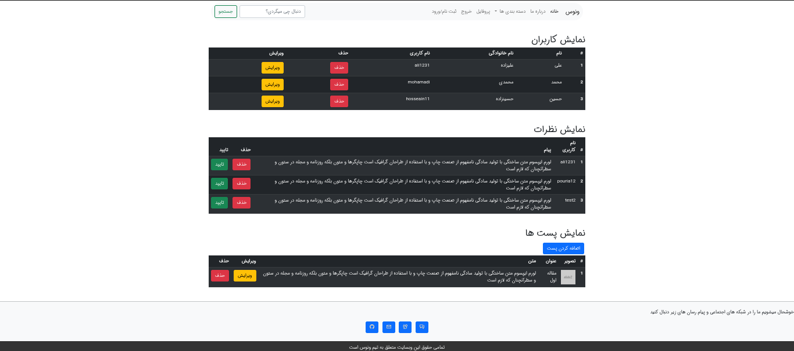
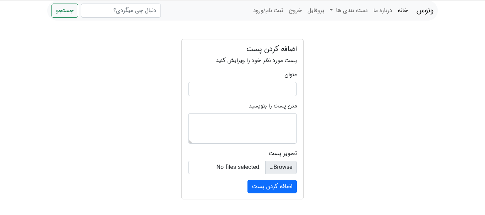

Hello, I tried to put the projects that I developed with html, css, bootstrap technologies in this repository.

## weblog venus
 The first one is a blog called the Venus blog, which has things like the admin panel and...:

 
 
 
 

## blog me
A personal website to put your skills, abilities and descriptions about yourself, which has an admin panel and...

 

 
 
 

## blog project fast zaban
A website for the collection of 504 commonly used English words. 

 
